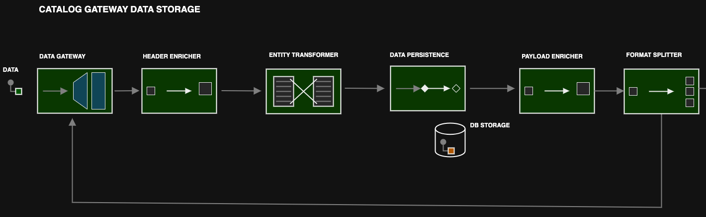
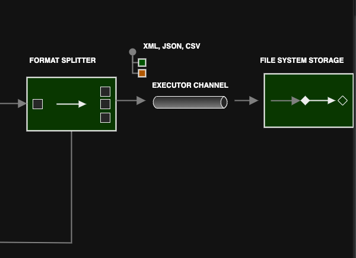

# Catalog Product Data Service

## Kotlin Implementation

### Overview

The Catalog product data service implementation basically implores [Enterprise Integration Pattern](https://www.enterpriseintegrationpatterns.com/) to solving a business problem
where a message goes through series of endpoints in an integration flow 

### Flow 1
#### Synchronous

- Data Message through gateway
- Message enrichment to preserve original request
- Data format to entity transformer
- Data persistence in service activator
- Format header enricher
- Format splitter



### Flow 2
#### Asynchronous

- Processing pushed format type to executor channel
- Writing to format file ( reading saved products from enriched header )



### Business Logic Design Patterns 
- Single Responsibility Principle - one responsiblity, one class
- Strategy Pattern - for deciding business logic at runtime ( Using maps to store business logic or functions ) 
- Chain Of Responsibility - for validation logic ( keeps core logic closed for modification )

### Additional Config

```yaml
file:
  write-path:
    csv:  # path to write csv file
    json: # path to write json file
```
## Dependencies Added
- Spring Integration - EIP 
- Bean Validation 2 - JSR 380
```xml
<dependencies >
    <dependency>
        <groupId>org.springframework.boot</groupId>
        <artifactId>spring-boot-starter-integration</artifactId>
    </dependency>

    <dependency>
        <groupId>org.springframework.boot</groupId>
        <artifactId>spring-boot-starter-validation</artifactId>
    </dependency>
</dependencies>
```

### Testing
The test you can simply use a curl request in a terminal as testing with swagger UI might not provide certain form data multipart headers

#### CSV Upload 
```shell

 curl -X 'POST' \
  'http://localhost:8080/catalog-products' \
  -H 'accept: */*' \
  -H 'Content-Type: multipart/form-data' \
  -F 'productData={"dataType":"CSV","outputFormats":["CSV","XML"]};type=application/json' \
  -F 'file=product.csv;type=text/csv' -v
```

#### JSON Upload 
```shell
curl -X 'POST' \
  'http://localhost:8080/catalog-products' \
  -H 'accept: */*' \
  -H 'Content-Type: multipart/form-data' \
  -F  'productData={"dataType":"JSON","outputFormats":["CSV","XML"]};type=application/json' \
  -F 'file=@products.json;type=text/plain' -v
```
